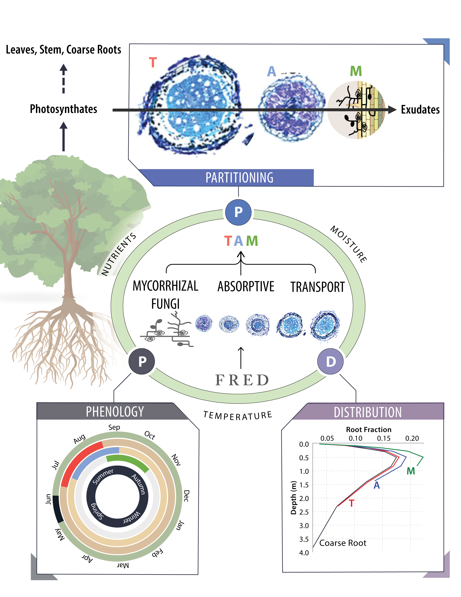

# TAM–Transport and Absorptive roots with Mycorrhizal fungi

**Wang, B.**, McCormack, M. L., Ricciuto, D. M., Yang, X., & Iversen, C. M. (2023). **Embracing fine‐root system complexity in terrestrial ecosystem modelling.** Global Change Biology.https://doi.org/10.1111/gcb.16659

---

As accelerated empirical advances in the last two decades establish clearly functional differentiation conferred by the hierarchical structure of fine-root orders and associations with mycorrhizal fungi, a need emerges to embrace this complexity to bridge the data-model gap in still extremely uncertain models. **Here, we propose a 3-pool structure comprising Transport and Absorptive fine roots with Mycorrhizal fungi (TAM) to model vertically resolved fine-root systems across organizational and spatial-temporal scales. Emerging from a conceptual shift away from arbitrary homogenization, TAM builds upon theoretical and empirical foundations as an effective and efficient approximation that balance realism and simplicity**.

---

## TAM
Proof-of-concept study making the case for TAM with the [simple_ELM](https://github.com/dmricciuto/simple_ELM/tree/rootcomplexity). NOTE: check out the branch **rootcomplexity**.

### data/
A series of Jupyter Notebooks written in Python but with source data accessible at .

### figures/
A few figures around TAM.

### UQ/
Performed with UQTk (v3.0.2;https://github.com/sandialabs/UQTk) under Python(2.7.5), cmake(3.11.0), and gcc(6.3.0)

### Publication/
A PDF copy of the manuscript published in **Global Change Biology**.